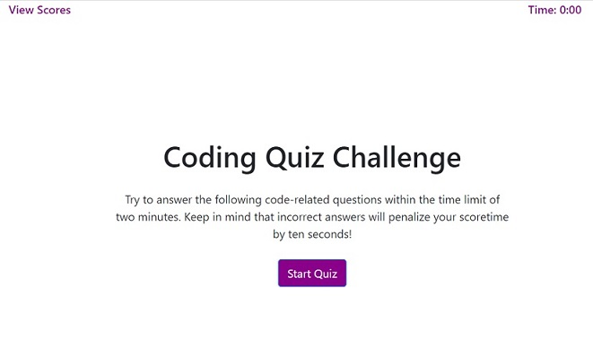
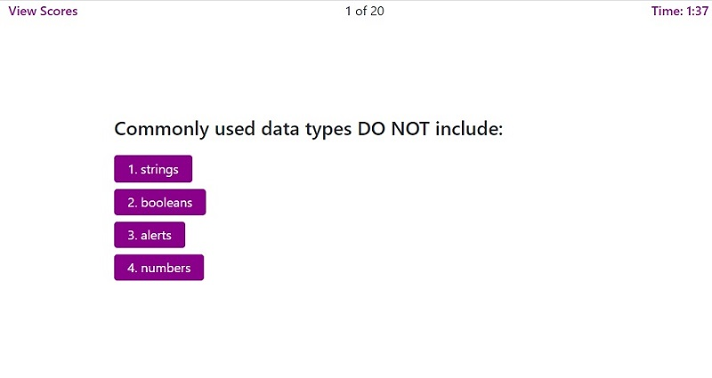
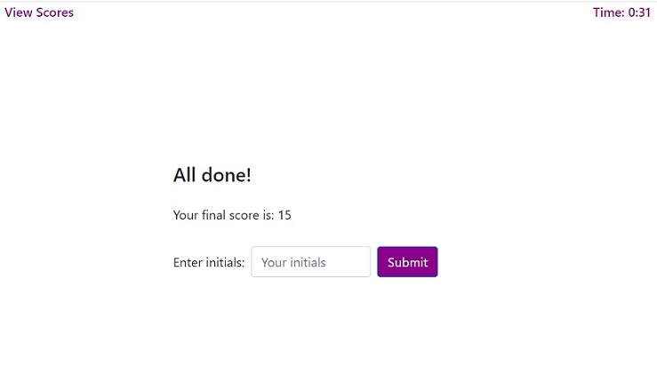
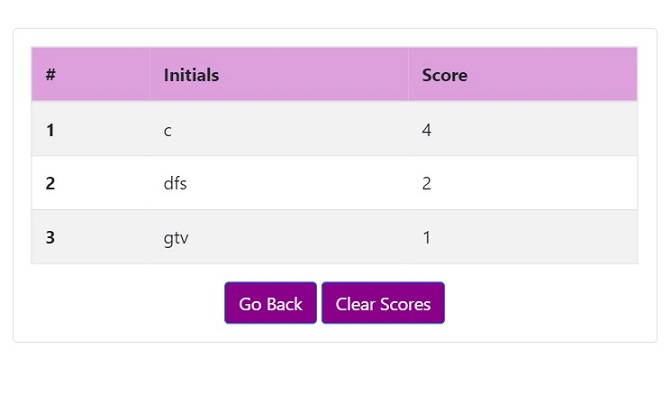

# Javascript Coding Quiz

 

## Description
This application performs a JavaScript coding assessment with a timed code quiz. The user is presented with a series of multiple-choice questions that test their knowledge of JavaScript programming. These questions are presented in a random sequence, and the user can answer them within a given time limit. Correct answers earn the user one score point. Incorrect answers will penalize the quiz time by ten seconds. Once all the questions have been answered correctly, or the quiz time runs out, the user can view thier score and choose to save it. The user can also view all the scores saved on the system. 

## Features
### Responsive Web Design 
This application is built using Responsive web design principles. Responsive web design provides better accessibility and an optimal viewing experience to the user, by ensuring that web pages render well on different devices and window / screen sizes. To achieve this, I have used the Bootstrap front-end component library to build my pages. 

## Functionality

The start page informs the user of the quiz rules. When the user clicks the *Start Quiz* button, the quiz is started and the user is prompted with a series of questions. The user can also select the *View Scores* link, to see the list of scores saved on the system by previous users. 

### Quiz 

* Once the user starts the quiz, the timer begins to countdown from 2 minutes.
* The user is presented with a random quiz question and a choice of answer options.
* When the user selects an option, the answer status message is displayed to the user briefly. The program then loads up the next question.
* If the answer chosen is correct, the user scores a point.
* If the answer chosen is wrong, the quiz time is reduced by 10 seconds as a penalty.
* When the user completes all 20 questions or if the quiz time runs out, the score is displayed in the results page.
* When the user clicks the *View Scores* link, the application checks if the user wishes to exit the quiz. If user chooses to proceed, the view scores page is displayed. 

### Quiz Results

* Once the quiz is complete, the user's score is displayed in the Results page. 
* The user can then enter their initials and click the submit button to save it to the system.
* If the user's initials are empty on submission, a validation message is displayed to the user.
* Once saved, the user is then redirected to the view scores page. 
* If the user clicks *View Scores* without saving the score, the application confirms if the user wishes to proceed without saving. If yes, the view scores page is displayed and the score is not saved. 

### View Scores

* The View Scores page displays a list of all scores saved on the system
* Clicking the *Go Back* button takes the user back to the quiz start page.
* Clicking *Clear Scores* clears all score data from the system.
